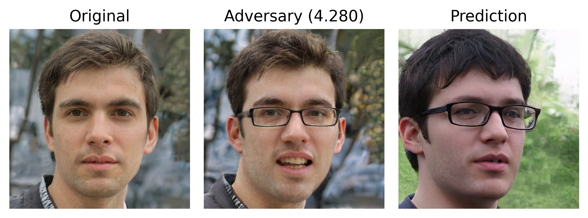

# Towards Assessing and Characterizing the Semantic Robustness of Face Recognition
This is the implementation for the paper *"Towards Assessing and Characterizing the Semantic Robustness of Face Recognition"*.

This README file shows how to use the implementation.
Unfortunately, running the assessments we show in our paper requires large amounts of computation.
Thus, we here we show a simplified version of our results.
Even in this simplified setup, a GPU is required, and computation time can be significant.

In this repo we show how to (0) generate the identities we will attack, (1) run PGD attacks, (2) run FAB attacks, (3) run Isotropic certification, and (4) run Anisotropic certification.
The computation times for these examples are, respectively: 10, 10, 15, 5, and 5 minutes.
These numbers were observed in an Nvidia GeForce RTX 3090.
Please bear these numbers in mind when running this code.

*Note:* given the computational requirements of our assessment, when running the computations, in practice, everything is run with a scheduler (like SLURM).
That is to say, all of our scripts are parameterized so that you can easily control them via standard scheduler-like scripts.

# Setup
## Get Anaconda
```bash
wget https://repo.anaconda.com/archive/Anaconda3-2020.07-Linux-x86_64.sh
bash Anaconda3-2020.07-Linux-x86_64.sh
```

## Download StyleGAN's weights
From Nvidia's official repository, you can go to [this link](https://drive.google.com/drive/folders/1MASQyN5m0voPcx7-9K0r5gObhvvPups7), download the file `karras2019stylegan-ffhq-1024x1024.pkl`, and move it to `models/pretrain/`.
Run a checksum to ensure you have the right file:
```bash
md5sum models/pretrain/karras2019stylegan-ffhq-1024x1024.pkl 
```
Which should return `5a20ed46ea6494a9e969db2f6b97a88a`.
This is a `pkl` file, which the code converts to PyTorch weights the first time the code is run.
On some machines, it is likely that the first time the code is run the convertion works fine, but the code exits for a (yet) unknown reason.
If this happens in your case, please simply run the code again.

## Download Face Recognition Models' weights
We use three FRMs: ArcFace, FaceNet^C and FaceNet^V. 
You only need to download the weights for the first one (ArcFace), as the weights for the other two are automatically downloaded when running the scripts.
For ArcFace's weights, we use the weights provided by the *InsightFace* public repo, available in [this link](https://github.com/deepinsight/insightface/tree/master/recognition/arcface_torch#model-zoo).

To get the weights, please go to [InsightFace's OneDrive link](https://onedrive.live.com/?authkey=%21AFZjr283nwZHqbA&id=4A83B6B633B029CC%215577&cid=4A83B6B633B029CC), go to the directory `ms1mv3_arcface_r50_fp16`, download the `backbone.pth` file, and move it to the directory `weights/ms1mv3_arcface_r50/`.
Run a checksum to be sure you got the right file:
```bash
md5sum weights/ms1mv3_arcface_r50/backbone.pth
```
Which should return `b9b1f8b29151d5564f1be869cc26bd23`.

## Install stuff
```bash
conda install pytorch torchvision torchaudio cudatoolkit=11.1 -c pytorch -c nvidia
conda install tqdm
pip install facenet-pytorch
```

## Create some directory
Run
```bash
mkdir embeddings
```

# Generate latent codes and images
We need latent codes in W space.
Each latent code corresponds to one image/identity.
For practical purposes, we only generate 5000 latent codes in this README, while in the paper, we generated up to 1M identities.
This factor can simply be changed by modifying the `NUM` variable.
Run the following lines:
```bash
OUTDIR=data/stylegan_ffhq_1M;
NUM=5000; 
rm -rf $OUTDIR; CUDA_VISIBLE_DEVICES=0 python generate_data.py \
-m stylegan_ffhq \
-o "$OUTDIR" \
-n "$NUM"
```
Running this code should take ~10 minutes, and requires 8.2 GB of disk. 
Naturally, running this code for 1M identities would take remarkably more time, so we do not show this example.

After running, this script will have populated the directory `$OUTDIR` (*i.e.* `data/stylegan_ffhq_1M`) with four files and one directory. 
We care about two items, in particular:
1. `ims` directory: filled with the images corresponding to the 5k identities.
2. `w.npy`: a numpy file containing the array of W latent codes corresponding to the 5k identities. 
This is a 5000 x 512 array, representing 5k vectors of dimension 512. 
Check this in a Python console with 
```python
import numpy as np
np.load('data/stylegan_ffhq_1M/w.npy').shape
```

With these embeddings, we can now run attacks.


# PGD attacks
## Running the attack
Now we can conduct a PGD attack with 5 restarts and 5 iterations by running a command of this sort.
```bash
frs_method=insightface; 
python main_attack.py \
--embs-file embeddings/embs_"$frs_method".pth \
--restarts 5 \
--iters 5 \
--output-dir pgd_attack_"$frs_method" \
--face-recog-method $frs_method \
--load-n-embs "$NUM" \
--attack-type manual \
--chunks 250 \
--num-chunk 0
```
Now we explain each flag:
* `--embs-file`: this script will first compute the embeddings (from the Face Recognition Model), and save them at the value passed to the `--embs-file` flag (*i.e.* `embeddings/embs_"$frs_method".pth` in this case).
This procedure should take ~3 minutes, while the rest of the time spent (about an extra minute) is spent on actually conducting the attack. 
This `.pth` file will be useful for running other experiments in the future, since these embeddings do not have to be recomputed.
For loading these embeddings, instead of computing them, we just need to add the `--load-embs` flag.

* `--restarts` and `--iters`: the restarts and iterations given to PGD are controlled via these flags.

* `--output-dir`: the name of the directory in which the results will be saved.

* `--face-recog-method`: name of the Face Recognition Model to use. 
Can be one of `insightface`, `facenet`, and `facenet-vggface2`.
These options, correspond, respectively, to ArcFace, FaceNet^C and FaceNet^V (in the paper's convention).

* `--load-n-embs`: number of embeddings to load from the file `--embs-file`. 
In case one wants to only consider a subset of the total embeddings.

* `--attack-type`: can be one of `manual` (which means PGD attack) or `fab-t` (which means the targeted version of the FAB attack).
These are the two attacks we report in the paper.

* `--chunks`: to ease parallelization of the computation, this script allows for chunking: it breaks the set of instances being attacked into chunks, and attacks each chunk separately.
The amount of chunks is controlled precisely by the `--chunks` parameter. 

* `--num-chunk`: for parallelization, *which* chunk is attacked is controlled by the `--num-chunk` parameter. 
If no number is passed to the `--num-chunk` parameter, the script will iterate through all the chunks, attacking them individually.


Thus, for attacking a subset of chunks (attacking all 250 of them, as set by the `--chunks 250` we ran earlier, would require too much time), please run
```bash
for idx in {1..9}; do
python main_attack.py \
--embs-file embeddings/embs_"$frs_method".pth \
--restarts 5 \
--iters 5 \
--output-dir pgd_attack_"$frs_method" \
--face-recog-method $frs_method \
--load-n-embs "$NUM" \
--attack-type manual \
--chunks 250 \
--load-embs \
--num-chunk $idx;
done
```

This command should take about 1 minutes per chunk, and we run for an extra 9 chunks.
So, in total, it should take about 9 minutes to run in its entirety.

After running this command, we have results for 10 chunks (out of 250).
Each chunk is composed of 5k/250 = 20 instances, and we computed attacks for 10 chunks, so, in total, we attacked 20*10 = 200 instances.
That is, we have results for 200 instances.
These results are saved at the directory `exp_results/pgd_attack_insightface`.
Inside this directory, there are various items.
The three items of interest are:
* `logs`: a directory full of `txt` files following the convention `results_chunk<X>of250.txt`, where `X` is a number between 0 and 9 in our example.
Each of these text files reports, for its respective chunk, the amount of successful attacks, the number of instances that were attacked (20 in our example), and the average magnitude of the perturbations that were found (|\delta\|_{M,2} in the paper's notation).
* `results`: a directory with `pth` files following the convention `results_chunk<X>of250.pth`.
There is one such file *per* chunk in which at least one adversarial example was found.
Upon loading these files with PyTorch (*i.e.* via `import torch; torch.load('exp_results/pgd_attack_insightface/results/results_chunk1of250.pth')`) you get a dictionary with three keys: `deltas` (the matrix of perturbation vector for each adversarial example that was found), `successes` (an array detailing for *which* instance in the chunk is it that adversarial examples were found), and `magnitudes` (a vector stating the magnitude of each perturbation that was found).
* `figs`: a directory with `jpg` images following the convention `ori_<A>_adv_<B>.jpg`.
There is one such image per adversarial example that was found.
Each of these images has three faces.
On the left, you find the original face from identity `A` (following the paper's notation); in the middle you find the modified face of identity `A` (A* in the paper's notation), and its title reports the perturbation's magnitude; on the right you find the face of identity B (following the paper's notation), with which A* is matched.
Next, we show an example of one such image. 


## Evaluating the attack
Once all the results (saved at `exp_results/pgd_attack__insightface/logs/results_chunk*of250.txt`) have been computed, you can evaluate them to know the attack's success rate.
This evaluation is performed by running the `main_attack.py` script with the flag `--eval-files` as follows:
```bash
python main_attack.py \
--output-dir pgd_attack_"$frs_method" \
--eval-files
```
Running this command creates the file `exp_results/pgd_attack_insightface/results.txt`.
This file states, over the chunks that were attacked, the number of successful adversarial attacks, the number of instances that were attacked, the attack's success rate, and the average magnitude of the perturbations.
Furthermore, this file also states the attribute-importance ranking, following the procedure we described in Section 3.5 in the paper.
The information about this ranking is composed by (1) the ranking itself and (2) the *p*-values of each pair-wise comparison of neighboring attributes in the ranking.
However, since our example attacked few instances (and therefore there are few adversarial examples found), most likely no statistically significant comparison will be found.
This lack of validity implies that a ranking cannot be found, and so the two entries (corresponding to the ranking and the *p*-values will be left empty).

The result's text file looks as follows:
```
successes:6
instances:200
rate:3.00
avg_mag:1.00

importance-order:NoneFound
order-pvals:Undefined
```
As stated before, the last two lines of this file (corresponding to the attribute ranking and the *p*-values) report that no statistically-significant conclusions could be found.

# FAB attacks
We can also run (targeted) FAB attacks by running
```bash
for idx in {0..9}; do
python main_attack.py \
--embs-file embeddings/embs_"$frs_method".pth \
--restarts 2 \
--iters 5 \
--n-target-classes 2 \
--output-dir fab_attack_"$frs_method" \
--face-recog-method $frs_method \
--load-n-embs "$NUM" \
--attack-type fab-t \
--chunks 250 \
--load-embs \
--num-chunk $idx
done
```
Analogous to the PGD attack we conducted earlier, this command will run attacks (in this case FAB attacks) on 10 chunks of the data.
These attacks are run with 2 restarts, 5 iterations and 2 target classes.
Each chunk should take about 1.5 minutes, so, in total, the 10 chunks should take about 15 minutes to finish.

After the computation is done, we get the same items as for the PGD attack: the `logs`, `results` and `figs` directories.
Each of the images in the `figs` directory corresponds to an adversarial example found by FAB.
Since FAB can find adversarial examples for each image, this directory should have as many images as instances were attacked (200 in our example).
We next show one nice adversarial example found by running the above command:


## Evaluating the attack
Analogous to the evaluation of PGD's results, we can evaluate FAB's results by running
```bash
python main_attack.py \
--output-dir fab_attack_"$frs_method" \
--eval-files
```
Similar to PGD's results, we get the text file at `exp_results/fab_attack_insightface/results.txt`, which reports
```
successes:200
instances:200
rate:100.00
avg_mag:9.82

importance-order:gender>age>eyeglasses>pose>smile
order-pvals:3.87E-25,2.26E-02,3.74E-02,1.48E-09
```
This result follows the same conventions as before.

# Certification
We next showcase both isotropic and anisotropic certification.
## Isotropic certification
We can (isotropically) certify one identity by running the command
```bash
instance=5;
sigma=1e-1

skip=$((1+$instance));
maxx=$((2*$skip));
python certify.py \
--skip $skip --max $maxx \
--outfile cert_results/sigma_$sigma-instance_$instance.txt \
--load-n-embs "$NUM" \
--face-recog-model $frs_method \
--sigma $sigma \
--N 10000
```
Running this command should take ~5 minutes.
This command will certify identity number 5 (for this example), under an isotropic distribution with sigma=1e-1, and with 10k Monte Carlo samples.
After running this command, the file `cert_results/sigma_1e-1-instance_5.txt` is generated.
This file reports instance number 5's certification radius.


## Anisotropic certification
We can (anisotropically) certify one identity by running the previous command, and simply adding the `--anisotropic-sigma` flag, as follows:
```bash
instance=5;
sigma=1e-1

skip=$((1+$instance));
maxx=$((2*$skip));
python certify.py \
--skip $skip --max $maxx \
--outfile cert_results/anisotropic-sigma_$sigma-instance_$instance.txt \
--load-n-embs "$NUM" \
--face-recog-model $frs_method \
--sigma $sigma \
--N 10000 \
--anisotropic-sigma
```
Running this command should take ~5 minutes.
This command will certify identity number 5 (for this example), under an anisotropic distribution with sigma=1e-1*inv(M), and with 10k Monte Carlo samples.
Here, M is the matrix we defined in the paper to account for the maximum perturbation allowed for each attribute dimension (*i.e.* the same matrix used for projection during PGD).
After running this command, the file `cert_results/anisotropic-sigma_1e-1-instance_5.txt` is generated.
This file reports instance number 5's *proxy* certification radius (proxy since an anisotropic distribution does not have a radius in the traditional sense).

# Perturbation budget
A fundamental quantity in our work is the perturbation budget allowed for each attribute.
These perturbation budgets can be modified via L17-21 in the `attack_utils/proj_utils.py` script, which has the following lines:
```python
ATTRS['age'] = 0.5
ATTRS['eyeglasses'] = 0.5
ATTRS['gender'] = 0.2
ATTRS['pose'] = 0.5
ATTRS['smile'] = 0.8
```
One can modify these quantities arbitrarily and re-run the experiments we showed here, yielding different results.
